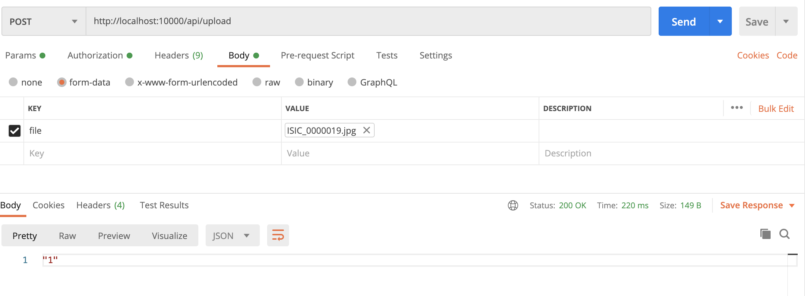

# PDCT-backend
Backend of the PDCT Melanoma project
The backend holds the model and expose an API route to predict if the sent image is a malignant melanoma or a benin one.

If the result is equal to `"0"` the mole is classified as a benin melanoma.

If the result is equal to `"1"` the mole is classified as a malignant melanoma.

# Disclaimer
We are not responsible of the given result and you may in any case see a doctor if you have any doubt about any of your moles.

# API
## How to run the API

```sh
cd API
docker build -t api .
docker run -p '10000:10000' api
```

## Test API on Postman



# Contibutors

- SPANIER Nathan
- RIVET Baptiste
- PETTERSSON Kristoffer
